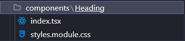

# Organização de pastas

Neste projeto vamos usar uma forma bem simples, e geralmente usada quando se trata de `styles.module.css`

## Passo 1

Criamos uma pasta chamada `components` dentro do nosso `src`

## Passo 2

Dentro da pasta `components` criaremos as pastas dos componentes

- O nome da pasta deve ser o nome do componente

- Dentro da pasta do componente deve ter um index.tsx e um styles.modules.css

Quando formos importar este componente ele não ficará com o nome da pasta e o nome do componente, com o index o TypeScript vai pegar logo ele ao invéz de procurar todos os arquivos do componente...
