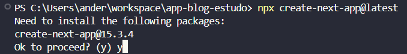
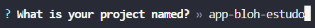
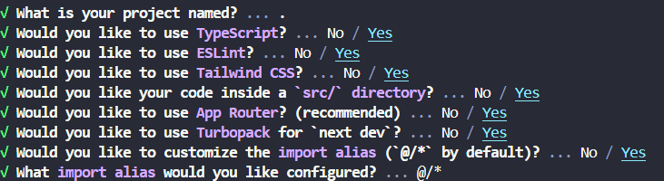

# **Criando um Projeto Next.js com as Melhores Práticas**

Este guia mostra o passo a passo para criar um projeto Next.js moderno e completo utilizando TypeScript, Tailwind CSS, estrutura `src`, ESLint, Turbopack e import aliases.

---

## ✅ Passo 1 – Criar o Projeto

Execute o seguinte comando no terminal para iniciar o setup:

```bash
npx create-next-app@latest
```

> `@latest`: garante que você usará a **versão mais recente** da CLI do Next.js.

---

## ✅ Passo 2 – Aceitar a Instalação

Após rodar o comando, será perguntado se deseja instalar o `create-next-app`. Digite:

```bash
y
```

> Isso confirma a instalação do utilitário de criação do projeto.

---

## ✅ Passo 3 – Configuração Interativa

Durante o processo, o terminal fará algumas perguntas. Abaixo estão os detalhes e recomendações:

### 📌 **Pergunta 1 – Nome do Projeto**

> "What is your project named?"

Digite o nome do seu projeto, por exemplo:

```bash
app-blog-estudo
```

Ou, se já estiver dentro da pasta do projeto, apenas:

```bash
.
```

### 📌 **Pergunta 2 – TypeScript?**

> "Would you like to use TypeScript?"

**Sim.** Use TypeScript para tipagem estática e maior segurança no código.

### 📌 **Pergunta 3 – ESLint?**

> "Would you like to use ESLint?"

**Sim.** O ESLint ajuda a manter um padrão de código e evita bugs comuns.

### 📌 **Pergunta 4 – Tailwind CSS?**

> "Would you like to use Tailwind CSS?"

**Sim.** Tailwind oferece uma abordagem utilitária para estilização rápida e responsiva.

### 📌 **Pergunta 5 – Pasta `src`?**

> "Would you like to use `src/` directory?"

**Sim.** A estrutura `src/` ajuda a organizar melhor os arquivos do projeto.

### 📌 **Pergunta 6 – App Router?**

> "Would you like to use the App Router?"

**Sim.** O novo roteador do Next.js (`app/`) oferece mais recursos, como layouts aninhados e streaming.

### 📌 **Pergunta 7 – Turbopack?**

> "Would you like to use Turbopack as the bundler?"

**Sim.** O Turbopack é o novo empacotador do Next.js, que substitui o Webpack e oferece maior desempenho.

> 📌 _Obs.: O Turbopack é como o `Vite`, porém focado em aplicações React de alta performance._

### 📌 **Pergunta 8 – Import Alias?**

> "Would you like to customize the default import alias (@/\*)?"

**Sim.** Usar aliases melhora a legibilidade e evita caminhos relativos longos.

#### Alias sugerido:

```bash
@/*
```

> Isso permite que você importe arquivos da pasta `src/` assim:

```tsx
import Button from "@/components/Button";
```

---

## 🖼️ Imagens de Referência

### 1. Confirmação de instalação:



### 2. Nome do projeto:



### 3. Resumo das configurações:



---

## ✅ Conclusão

Ao final do processo, seu projeto Next.js estará pronto para começar com uma estrutura moderna, produtiva e escalável!

### Comando para iniciar o projeto:

```bash
cd app-blog-estudo
npm run dev
```

> 💡 Dica: salve essas configurações como padrão para usar em novos projetos futuramente.
