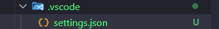

# **Configurações do VSCode**

Vamos usar as seguintes configurações do VSCode:

```json
{
  "window.zoomLevel": 1,
  "breadcrumbs.enabled": false,
  "editor.fontSize": 15,
  "debug.console.fontSize": 24,
  "terminal.integrated.fontSize": 24,
  "editor.glyphMargin": false,
  "workbench.activityBar.location": "hidden",
  "editor.lineNumbers": "off",
  "files.eol": "\n",
  "editor.defaultFormatter": "esbenp.prettier-vscode",
  "editor.formatOnSave": true,

  "editor.codeActionsOnSave": {
    "source.fixAll.eslint": "explicit"
  },

  "[javascript]": {
    "editor.defaultFormatter": "esbenp.prettier-vscode"
  },
  "[typescript]": {
    "editor.defaultFormatter": "esbenp.prettier-vscode"
  },
  "[xml]": {
    "editor.defaultFormatter": "esbenp.prettier-vscode"
  },
  "[svg]": {
    "editor.defaultFormatter": "esbenp.prettier-vscode"
  },
  "[html]": {
    "editor.defaultFormatter": "esbenp.prettier-vscode"
  }
}
```

---

Criaremos uma pasta na Raíz do nosso projeto chamada: `.vscode`, dentro dela criamos um arquivo chamado: `settings.json` e dentro dele irá esse código


