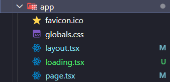

# 🔄 Loading e Suspense no Next.js (App Router)

A renderização de componentes assíncronos em aplicações modernas exige feedbacks visuais bem definidos. Com o **Next.js App Router**, temos duas abordagens importantes para isso: o uso do arquivo especial `loading.tsx` e o componente `Suspense` do React.

---

## 🌀 O que é o `loading.tsx`?

O `loading.tsx` é um arquivo especial que pode ser criado **dentro de qualquer rota** do App Router. Ele será renderizado **automaticamente** sempre que uma requisição assíncrona for disparada na rota correspondente.

> 📌 O nome do arquivo deve ser **exatamente `loading.tsx`**, escrito em letras minúsculas.

### ✅ Exemplo de uso:

```tsx
// app/(site)/page/loading.tsx
import { SpinLoader } from "@/components/SpinLoader";

export default function LoadingRoot() {
  return <SpinLoader />;
}
```



---

## ⚠️ Limitação do `loading.tsx`

O componente `loading.tsx` **substitui totalmente a página** durante o carregamento. Isso significa que **componentes como header, footer, menu lateral, etc. desaparecem temporariamente**, sendo substituídos apenas pelo loader.

Essa experiência pode ser desconfortável para o usuário.

---

## 🧩 Como resolver isso? Use `Suspense`

O **`Suspense`** é um componente nativo do React que permite exibir um fallback (ex: loader) enquanto **apenas uma parte da página** está sendo carregada.

Assim, você mantém toda a estrutura visível (header, footer, layout) enquanto apenas o conteúdo principal (como uma lista de posts) exibe o carregamento.

### 🧪 Exemplo com `Suspense`:

```tsx
import { PostsList } from "@/components/PostsLists";
import { SpinLoader } from "@/components/SpinLoader";
import { Suspense } from "react";

export default async function Home() {
  return (
    <>
      <header>
        <h1 className="text-8xl">Este é um header</h1>
      </header>

      <Suspense fallback={<SpinLoader backgroundSize="h-10" />}>
        <PostsList />
      </Suspense>

      <footer>
        <h1 className="text-8xl">Este é um header</h1>
      </footer>
    </>
  );
}
```

### 📦 PostsList (componente assíncrono)

```tsx
import { postRepository } from "@/repositories/post";

export const PostsList = async () => {
  const posts = await postRepository.findAll();

  return (
    <div>
      {posts.map((post) => (
        <p key={post.id}>{post.author}</p>
      ))}
    </div>
  );
};
```

---

## ✅ Quando usar `loading.tsx`?

- Quando a **rota inteira** depende de uma requisição;
- Para páginas que **têm carregamento centralizado** e não precisam manter estrutura de layout enquanto carregam.

## ✅ Quando usar `Suspense`?

- Para **conteúdo assíncrono parcial** dentro da página;
- Quando quiser manter o layout da tela intacto (ex: header, nav, etc);
- Para componentes que utilizam **`fetch` ou `async/await`**, como listas, gráficos e dashboards.

---

## 🧠 Dica de ouro

Combine os dois! Use o `loading.tsx` como fallback geral da rota e o `Suspense` para carregar seções específicas, otimizando ainda mais a experiência do usuário.

> "Uma boa UX é feita de micro detalhes. Um loader bem posicionado evita frustração e melhora a percepção de performance."
