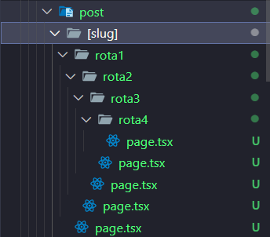

# Rotas Dinâmicas

São rotas que são criadas altomáticamente

Imagine a seguinte situação, tenho um app de rede social, onde cada usuário tem sua página, supnonhamos que meu site tenha 10 usuários, eu poderia criar uma rotapara cada um usando o App Router... Mas e se tivermos 10.000 usuários, criaríamos 10.000 rotas??

Não, isso se torna inviável

---

## Criando rotas dinâmicas no Next.js

Criamos a nossa rota dinâmica em Next.js usando [] (colchetes) envolvendo o nome da pasta da rota, e dentro dela, a convenção e padrão do App Router `page.tsx`

> Lembrando que o nome do componente pode ser qwualquer coisa desde que seja exportado como padrão


```tsx
export default function PostSlugPage() {
  return <h1 className="p-20 text-8xl/tight font-extrabold">Teste</h1>;
}
```

---

## Trabalhando com as rotas dinâmicas

Vimos até agora, que podemos trabalhar com props especiais: children

Mas temos outro prop especial que podemos usar, e será bem usado nesse caso

### params

```tsx
export default async function PostSlugPage({ params }) {
  return (
    <>
      <h1 className="p-20 text-8xl/tight font-extrabold">Teste</h1>
    </>
  );
}
```

Esta propriedade cosegue epgar parâmetros da url do nosso site

Ela retornará uma `Promisse`, o que nos diz que precisaremos de um `await` para esperar a requisição terminar

Dentro dessa `Promisse` teremos o parâmetro do nome da pasta que usamos para referênciar nossa rota dinâmica, no nosso caso [slug]

Esse `slug` será a url dinâmica do nosso site, e poderemos usar ela para nossos próprios fins

```tsx
export default async function PostSlugPage({ params }) {
  const { slug } = await params;

  return (
    <>
      <h1 className="p-20 text-8xl/tight font-extrabold">Teste</h1>
      <p>{slug}</p>;
    </>
  );
}
```

> Quando tivermos uma rota dinâmica com o mesmo nome de um rota estática, o Next.js sempre renderizará a rota estática...

---

## Tipando o params

Como já foi falado, o params retorna uma promisse, e essa promisse retorna o parâmetro da nossa url, e ntão a tipagem é simples

```tsx
type PostSlugPageProps = {
  params: Promise<{ slug: string }>;
};
```

Daí colocamos em nosso componente:

```tsx
export default async function PostSlugPage({ params }: PostSlugPageProps) {
  const { slug } = await params;
  console.log(slug);

  return (
    <>
      <h1 className="p-20 text-8xl/tight font-extrabold">Teste</h1>
      <p>{slug}</p>
    </>
  );
}
```

---

## Rotas Estátics dentro de rotas dinâmicas

Podemos ter rotas estáticas dentro de rotas estáticas

ecada uma dessas rotas estáticas terão acesso ao params da rota dinâmica



Temos nossa rota dinâmica `[slug]` e 4 rotas estáticas:

- rota1
- rota2
- rota3
- rota4

Cada uma dessas rotas terão acesso ao params `[slug]` da rota dinâmica

#### Exemplo ultima rota:

```tsx
type Rota1Props = {
  params: Promise<{ slug: string }>;
};

const Rota1 = async ({ params }: Rota1Props) => {
  const { slug } = await params;

  return (
    <>
      <h1 className="p-20 text-8xl/tight font-extrabold">Rota 4</h1>
      <p>{slug}</p>
    </>
  );
};

export default Rota1;
```

**URL: `http://localhost:3000/post/teste-rota/rota1/rota2/rota3/rota4`**


